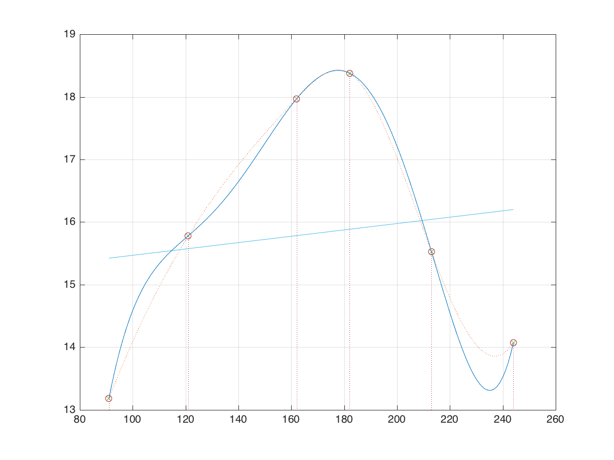
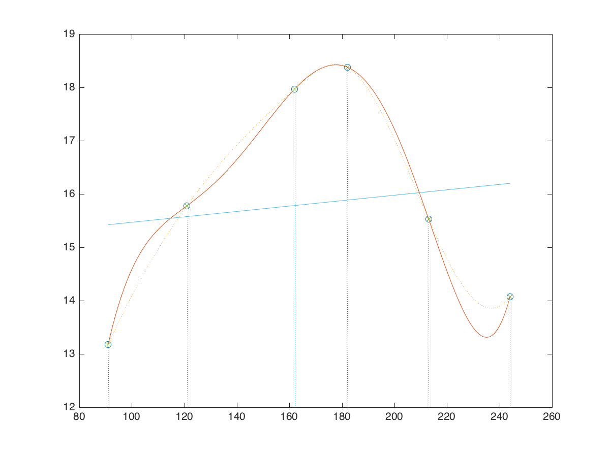

Interpolation och minstakvadratanpassning
===

## Uppgift 1a

Vi skall anpassa ett femtegradspolynom
$c_1 + c_2x + c_3x^2 + c_4x^3 + c_5x^2 + c_6x^5$ till mätdata,
och därmed lösa ett ekvationssystem av följande typ.

$$
\begin{pmatrix}
1 & x_1 & x_1^2 & x_1^3 & x_1^4 & x_1^5 \\
1 & x_2 & \ldots & \ldots & \ldots & x_2^5 \\
\vdots & \vdots & \vdots & \vdots & \vdots & \vdots \\
1 & x_5 & \ldots & \ldots & \ldots & x_5^5 \\
\end{pmatrix}
\mathbf{c} = \mathbf{y}
$$

Det görs med Gausselimination och plottas i matlab.  Som jämförelse plottas
samma data med matlabs
`spline`-kommando.  Resultatet visas i figur @fig:fig1a.

{#fig:fig1a}

~~~matlab
x = [91 121 162 182 213 244]';
y = [13.18 15.78 17.97 18.38 15.53 14.07]';
A = [ones(6,1) x x.^2 x.^3 x.^4 x.^5];
c = A \ y;
X = x(1):x(6);
P = c(1) + c(2)*X + c(3)*X.^2 + c(4)*X.^3 + c(5)*X.^4 + c(6)*X.^5;
stem(x, y, ':')
hold on
axis([80, 260, 13, 19])
plot(X, P), grid
Pm = spline(x, y, X);
hold on
plot(X, Pm, ':')
P(157 - 90)
P(227 - 90)
~~~

Solens uppetid en viss dag finns i `P(dagnr - 90)`. Det ger att 6
juni (dag\ 157) var solen uppe 17.69\ h, och 15 augusti (dag\ 227) var den
uppe 13.73\ h.

## Uppgift 1b

Här har matlabs
`polyfit` och `polyval` använts för att anpassa ett andragradspolynom till
mätpunkterna. Soltiden för den 6\ juni blir 17.73\ h med denna modell. Se
figur @fig:fig1b.

{#fig:fig1b}

~~~matlab
x = [91 121 162 182 213 244]';
y = [13.18 15.78 17.97 18.38 15.53 14.07]';
d = polyfit(x, y, 2);
X = x(1):x(6);
P = polyval(d, xplot);
plot(x, y, 'x', X, P), grid
~~~

## Uppgift 1c

Här använder vi som modellfunktion
$c_1 + c_2 \cos{\omega t} + c_3 \sin{\omega t}$, där $\omega = 2\pi/365$.
Eftersom vi har cykliska data med en period på 365 dagar bör det ge en god
anpassning. Data har kompletterats så hela året täcks. Residualkurvan
har plottats separat. Resultatet visas i figur @fig:fig1c.

Felkvadratsumman fås som $\mathbf{r}^T \mathbf{r}$, där $\mathbf{r}$ är
residualvektorn, och är $1.9750$.
Nationaldagens soltid är `F(157)` $= 17.7654$.

{#fig:fig1c}

~~~matlab
% lade till dag 365 med samma värde som dag 1
x = [1 32 60 91 121 162 182 213 244 274 305 335 365]';
y = [6.13 8.02 10.42 13.18 15.78 17.97 18.38 15.53 14.07 11.43 8.73 6.55 6.13]';
w = 2 * pi / 365;
A = [ones(13, 1) cos(w*x) sin(w*x)];
c = A \ y;
X = x(1):x(13);
F = c(1) + c(2) * cos(w*X) + c(3) * sin(w*X);
r = y - A * c;   % residual
fkvsum = r' * r  % felkvadratsumma
F(157)           % 6 juni
subplot(1, 2, 1)
plot(x, y, 'r:o', X, F), grid
title('Anpassning med trigonometriskt uttryck')
subplot(1, 2, 2)
plot(x, r), grid
title('Residualkurva')
~~~
